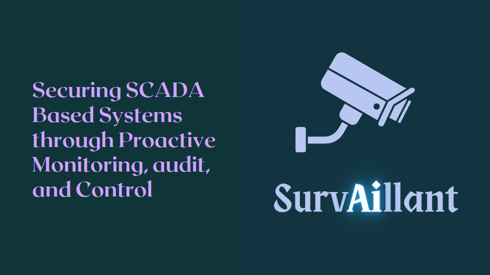

# SurvAIllant

This project enhances the security of SCADA devices by developing a comprehensive system for real-time monitoring and threat detection between supervisory control and PLCs.

**_Built using Ignition, Node-RED, Wireshark, Django, and various Python libraries._**

## 🚀 Objectives

👉 Monitor and secure communication between supervisory control and PLCs.  
👉 Detect anomalies and security threats in real-time.  
👉 Provide an intuitive web portal for alert notifications and monitoring.  
👉 Ensure the reliability and security of critical infrastructure.  

## Features and Functionality

📚 Real-time monitoring of communication packets.  
📚 Anomaly and threat detection using machine learning models.  
📚 Web portal for displaying notifications and alerts (Django).  
📚 Integration with physical hardware including motors and sensors.  
📚 Secure data handling and processing.  

## 💡 Work Included

## How to Build and Run

1. **Setup Hardware and Network:**
   - Connect real motors, sensors, and PLCs.
   - Set up the Ignition platform for supervisory control.
   - Integrate Node-RED for PLC programming.

2. **Capture and Analyze Packets:**
   - Use Wireshark to capture communication packets between supervisory control and PLCs.
   - Save the captured packets in a suitable format for further processing.

3. **Feature Extraction:**
   - Use Python scripts with libraries like NumPy and Pandas to convert packet data into CSV format.
   - Extract relevant features for training machine learning models.

4. **Train Machine Learning Models:**
   - Train the Random Forest, Logistic Regression, and One-Class SVM models on the extracted features.
   - Validate and optimize the models for accurate anomaly detection.

5. **Deploy Models:**
   - Deploy the trained models to monitor real-time communication between supervisory control and PLCs.
   - Implement the models to detect anomalies and potential security threats.

6. **Setup Django Web Portal:**
   - Install Django and set up the web portal.
   - Integrate the notification system to alert users of detected threats.
   - Ensure the web portal provides real-time updates and an intuitive interface for monitoring.

7. **Project Management with Jira:**
   - Use Jira to track project progress and manage tasks.
   - Collaborate with team members and ensure timely completion of milestones.

8. **Monitor and Maintain:**
   - Continuously monitor the system for potential threats.
   - Regularly update models and features to adapt to new security challenges.
   - Maintain the hardware and software components to ensure seamless operation.

## Technologies Used

- **Ignition:** For supervisory control and data acquisition.
- **Node-RED:** For PLC programming and integration.
- **Real Motors and Hardware:** Including sensors for real-world operations.
- **Wireshark:** For packet capture and analysis.
- **Django:** For building the web portal.
- **Python (NumPy, Pandas, etc.):** For data processing and feature extraction.
- **Machine Learning Models:** Random Forest, Logistic Regression, One-Class SVM for anomaly detection.
- **Jira:** For project management and task tracking.

**_NOTE: PLEASE LET ME KNOW IF YOU DISCOVERED ANY BUG OR YOU HAVE ANY SUGGESTIONS_**
